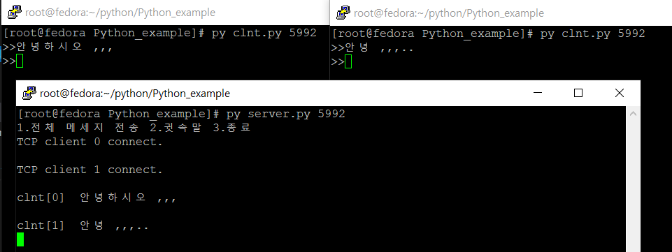
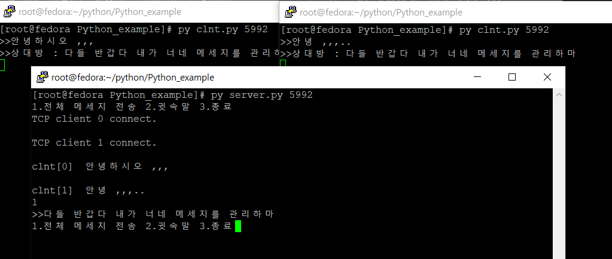
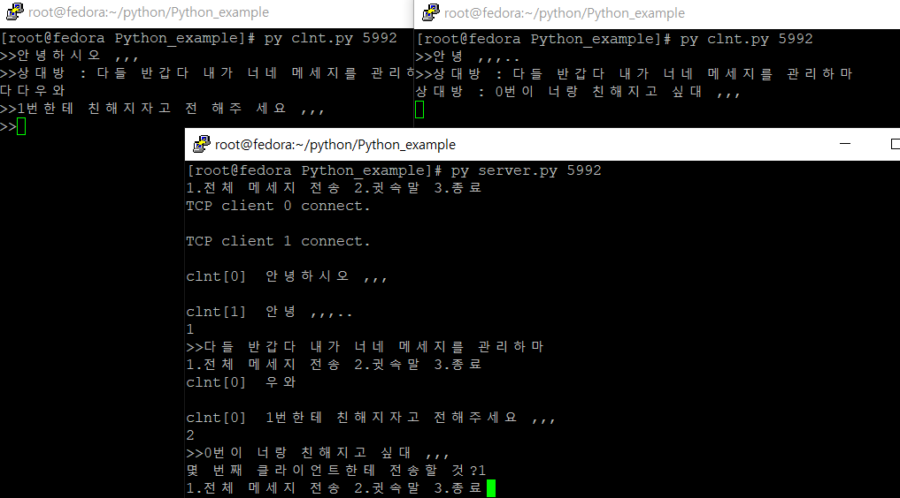
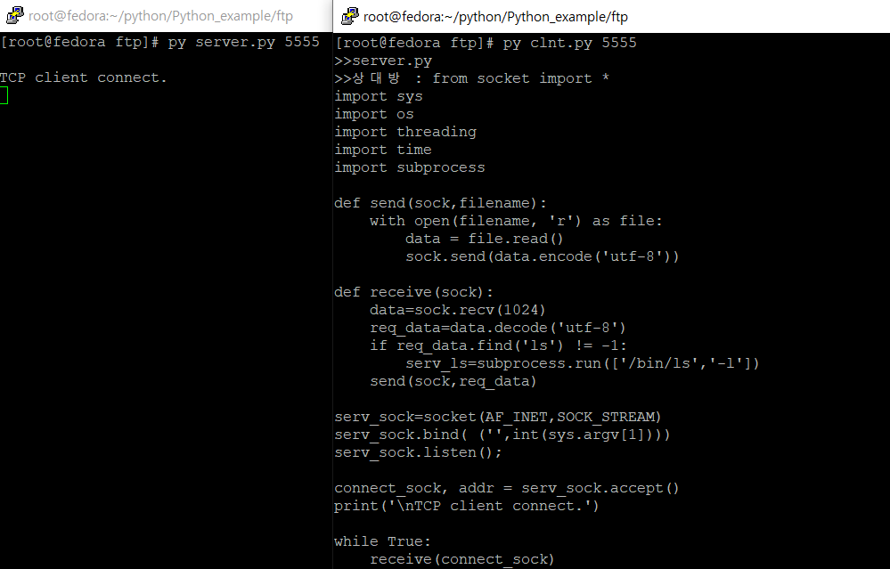

# Python_Network
> 간단한 네트워크 프로그래밍을 파이썬으로 구현해보고자 만들었습니다.
---
***구현 목록***
1. Multi-chatting (6.23 완료) 
2. FTP (6-25 완료)
  --- 
# 1. Multi-chatting
> 소켓을 통한 Multi-Chatting입니다. Thread를 통해 동시에 여러 Client가  접속할 수 있습니다. Server에는 Send를 전체적으로 다루고 있는 Thread  하나를 생성하였고, Client마다 Receive를 할 수 있는 개별의 Thread를  통해서 메세지 전송과 수신을 동시에 할 수 있게 하였습니다.

**옵션**
1. 전체전송 2. 귓속말

* *  **1.전체전송**: 서버와 연결된 Client의 소켓 정보를 cnt[]배열에  저장한 후 순차적으로 counting하여 배열에 저장하였습니다.  그 후 cnt[]배열에 저장 된 전체 client들에게 broadcast 하는 방식으로 구현하였습니다.

* * **2.귓속말:** cnt[]배열에 저장 된 socket 정보를 입력하여  해당 client에게만 메세지를 전송하도록 구현하였습니다.

># 구현 사진

**후기**
* 다른 Multi-Chatting 구현을 보면 Server에서 Client의 메세지를 받자마자  연결 된 모든 Client한테 메세지를 브로드캐스트하는 예제를 많이 보았다.        
하지만 나는 Client한테 메세지를 Server에서 저장하고 필요한 메세지만  브로드캐스트할 것인지 유니캐스트할 것인지 정하는 방식으로 구현하였다.

---
# 2. FTP

>python은 ftplib라는 표준 라이브러리가 존재하여 이 라이브러리를  사용하면 매우 간단하게 구현가능합니다. 하지만 저는 실질적으로 ftp보단 ftp과정을 python의 socket과정을 거쳐서 파일 입출력을 사용해보는 것을 목적을 두었기 때문에 ftplib 라이브러리는 사용하지 않았습니다. 또한  다양한 ftp 예제는 server의 처리에서 다양한 시스템 콜을 처리하지만  이번 python에서 구현한 ftp는 매우 협소하게 원하는 파일 이름을 받고  파일 이름을 열어서 내용을 보내는 식으로 아주 간단하게 구현하였습니다.

**동작**
* Server는 Client의 요청만을 기다리고 그에 대응하는 응답을 해주기 때문에 Server에서는 Thread를 사용하지 않았습니다. Client는 주기적으로 Server에게 요청도하고 응답도 받아야하기 때문에 send, receive에 해당하는 Thread를 생성하였습니다.

># 구현 사진

**후기**
* 이번 FTP는  매우 협소하게 원하는 파일 이름을 받고 파일 이름을 열어서  내용을 보내는 식으로 아주 간단하게 구현에 목적을 두었기에 내가봐도  부끄러운 작품이다.  그렇지만 제대로 된 FTP는 C언어를 사용해서 제대로 작성할 예정이다.
